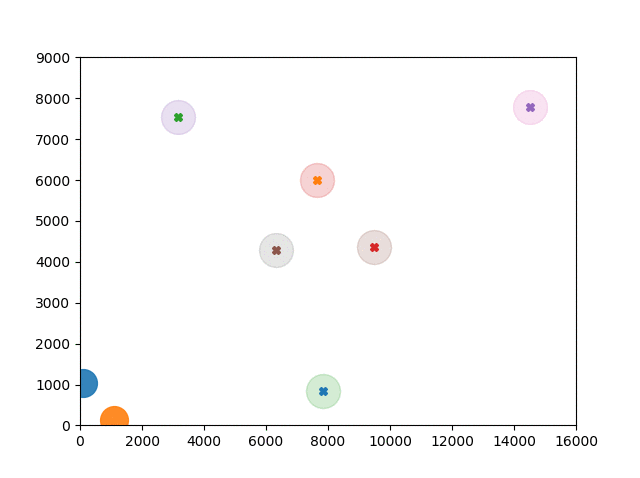

# "Coders Strike Back" - Simulation in Python



# Install

    pip3 install "git+https://github.com/ApfelPresse/csb-python-sim.git#egg=csb-sim"

# Quick start

```python
import csb_sim

def main():
    simulation = csb_sim.Sim(checkpoints=csb_sim.level_pool[0])
    while True:
        for i, pod in enumerate(simulation.pods):
            cp = simulation.checkpoints[pod.ncpid]
            raw_angle_next_cp = pod.diff_angle(cp)
            angle = max(-18, min(18, raw_angle_next_cp))

            pod.apply(100, angle)

        simulation.on_round()

        for pod in simulation.pods:
            if pod.checked == int(len(simulation.checkpoints) * simulation.laps) or pod.timeout < 0:
                return


if __name__ == '__main__':
    main()
```

## Additional resources
  1. https://github.com/inoryy/csb-ai-starter
  2. http://files.magusgeek.com/csb/csb_en.html
